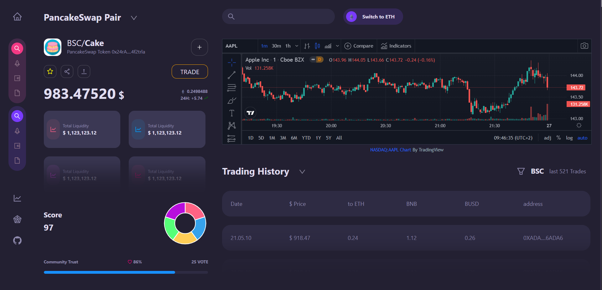
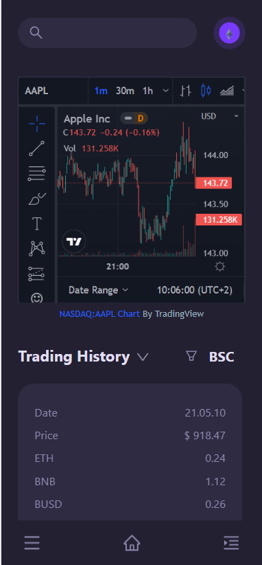

This UI is still update

<h1>Start</h1>
Yarn dev
 
 
 
<h4>Pratice Build Dashboard Crypro</h4>
<h4>If possible . You can pratice with me to improve it.</h4>
UI: https://dribbble.com/shots/16469084-Crypto-Dashboard/attachments/11234299?mode=media

  <h3>Desktop</h3>
  
   
   
  <h3>Mobile</h3>
  

